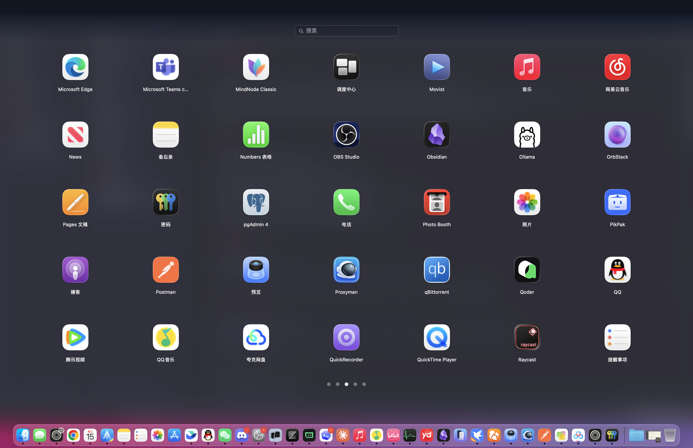

# Lunchpad

Lunchpad brings the classic full-screen macOS app launcher back to macOS 26 Tahoe.

It is built with AppKit and follows the familiar Launchpad experience: open it with a
four-finger pinch, browse apps page by page, search by name, open logical folders, and launch an
app with one click. The name is intentional: Lunchpad is to Launchpad what `reqwest` is to
`request`.



## Highlights

- Native full-screen AppKit interface
- Four-finger pinch activation and spread-to-dismiss
- Paged app grid with two-finger horizontal swiping
- Search using localized application names
- Logical folders, including the default Other folder
- Automatic updates when apps are installed, removed, or replaced
- Layout that adapts to the Dock on any screen edge
- Menu bar icon and configurable global hot key
- Native settings in English and Simplified Chinese
- No cloud service, account, or network connection required

## Requirements

- macOS 26.0 or later
- Apple Silicon
- Swift 6 and the Xcode command-line tools when building from source

The four-finger gesture has currently been verified with a built-in Force Touch trackpad.

## Build and install

Download the latest DMG from
[GitHub Releases](https://github.com/arichyx/lunchpad/releases), open it, and drag Lunchpad to the
Applications folder.

Build a release app bundle from source with:

```bash
cd /absolute/path/to/lunchpad
./Scripts/package-app.sh
```

The script creates:

```text
dist/Lunchpad.app
dist/Lunchpad-0.1.0-macos-arm64.dmg
dist/Lunchpad-0.1.0-macos-arm64.zip
dist/SHA256SUMS.txt
```

Verify the complete package with:

```bash
VERSION=0.1.0 ./Scripts/verify-package.sh
```

Lunchpad uses an ad-hoc signature because the project does not require an Apple Developer
account. A copy downloaded from the internet may need to be approved once in
**System Settings → Privacy & Security** before it can open.

## Using Lunchpad

Lunchpad starts quietly in the menu bar and does not open the full-screen interface at launch.

- Pinch inward with four fingers to show Lunchpad.
- Spread outward with four fingers (the reverse of the opening pinch) to close Lunchpad while it
  is visible. The gesture is recognized only while Lunchpad is on screen.
- When macOS is showing the desktop, an inward pinch restores the displaced windows without
  opening Lunchpad, regardless of how Show Desktop was entered.
- Alternatively, press Control-Shift-Space or left-click the menu bar icon.
- Swipe horizontally with two fingers, use the arrow keys, or click a page dot to change pages.
- Type in the search field to find an app.
- Click an app to close Lunchpad immediately and launch it.
- Click a folder to browse its contents.
- Press Escape or click empty space to leave a folder or close Lunchpad.
- Right-click the menu bar icon for Show, Settings, and Quit actions.

If macOS performs another action for the same four-finger gesture, disable Four-Finger Pinch in
Lunchpad Settings or change the system gesture in System Settings.

## Settings

Open Settings from the menu bar icon or press Command-Comma while Lunchpad is active. Changes apply
immediately and are stored locally.

- **Language** changes Lunchpad's own interface between Follow System, English, and Simplified
  Chinese. It does not change application names, which continue to follow macOS bundle localization.
- **Application Order** sorts apps by name, by the app bundle's filesystem creation time, or by its
  modification time. Both time modes are newest-first; creation time is not guaranteed to be the
  installation or release date. Folder positions and stored logical layout positions are preserved
  when the mode changes.
- **Keyboard Shortcut** records a modified key or function key. Use Clear to disable the global hot
  key. Lunchpad keeps the previous shortcut when Carbon reports a registration conflict. macOS does
  not provide a complete public registry of every application-level or system shortcut, so a
  successfully registered combination can still overlap behavior handled above Carbon.
- **Launch at Login** uses the macOS login-item service and is available in the packaged app.
- **Four-Finger Pinch** can stop or restart the existing trackpad monitor without restarting
  Lunchpad.

The default shortcut is Control-Shift-Space. For development and hardware testing,
`LUNCHPAD_HOTKEY` can override the stored setting for one process:

```bash
LUNCHPAD_HOTKEY=control-option-l .build/debug/Lunchpad
LUNCHPAD_HOTKEY=disabled .build/debug/Lunchpad
```

Recognized override values are `control-shift-space`, `control-option-l`, and `disabled`. While an
override is active, Settings displays it as externally managed and disables shortcut editing.

## Local data

Lunchpad stores page order and logical folder assignments locally at:

```text
~/Library/Application Support/com.arichyx.Lunchpad/layout.sqlite3
```

Logical folders do not move or modify real `.app` bundles. Removing a logical folder only returns
its apps to the root level.

## Development

Lunchpad is a Swift Package Manager project and does not require an Xcode project.

```bash
swift build --package-path /absolute/path/to/lunchpad
swift test --package-path /absolute/path/to/lunchpad
/absolute/path/to/lunchpad/.build/debug/Lunchpad
```

The trackpad connection and report format are documented in
[`Docs/IOKitMultitouch.md`](Docs/IOKitMultitouch.md). The app bundle is assembled by
[`Scripts/package-app.sh`](Scripts/package-app.sh).

Release tags, branches, and GitHub Release automation are documented in
[`Docs/RELEASING.md`](Docs/RELEASING.md).

## Known limitations

- External Magic Trackpads may use report formats that are not handled yet.
- Keyboard navigation and drag-to-create folder editing are not implemented yet.
- Ad-hoc builds cannot be notarized and may require manual approval after download.
- Confirm that `Assets/AppIcon.png` is licensed for redistribution before publishing binaries.

## License

Lunchpad is available under the [MIT License](LICENSE).
